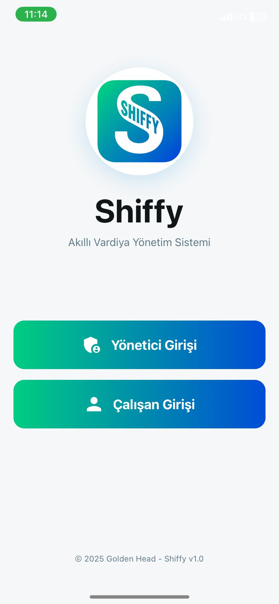
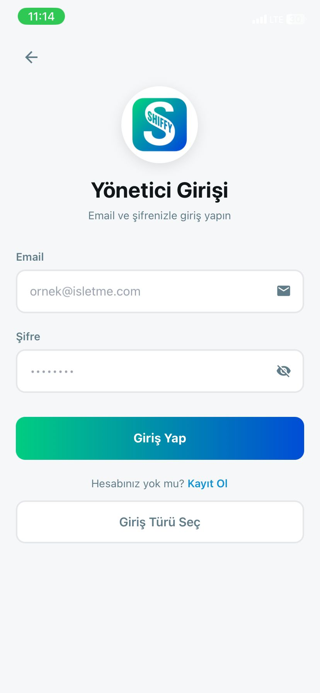
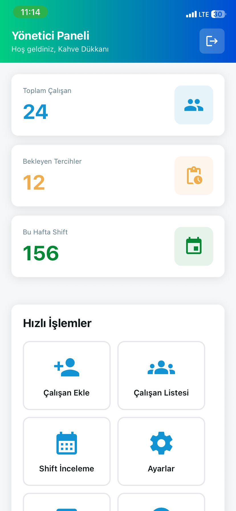
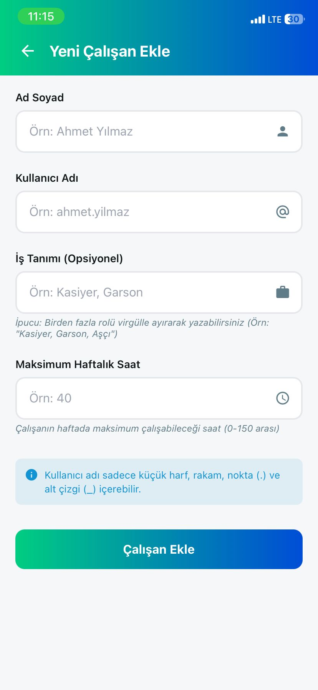
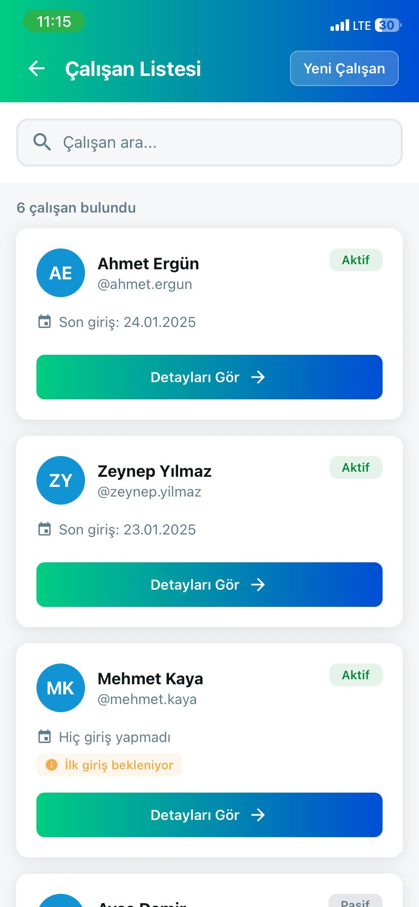
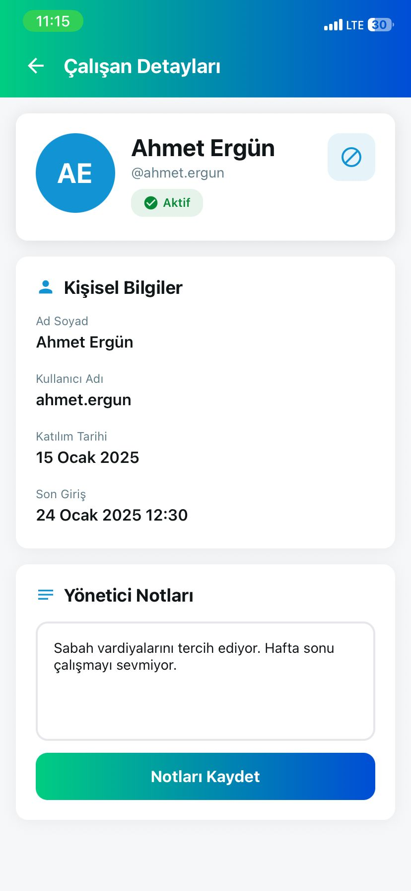
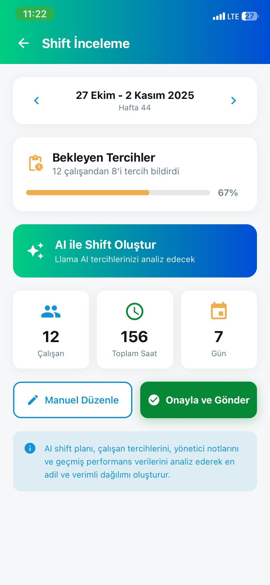
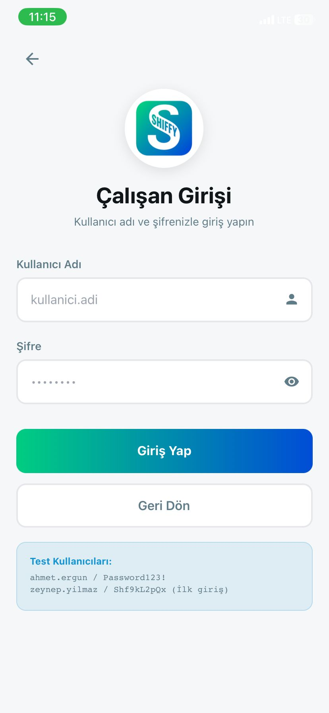
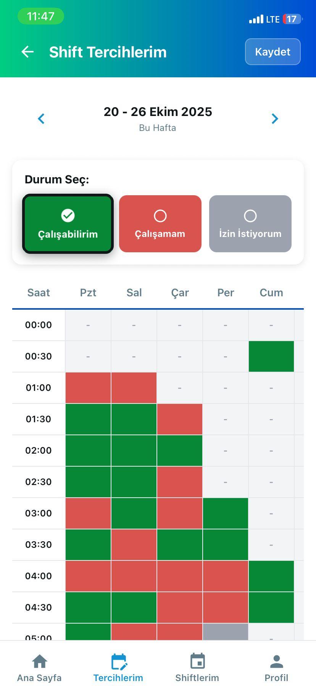
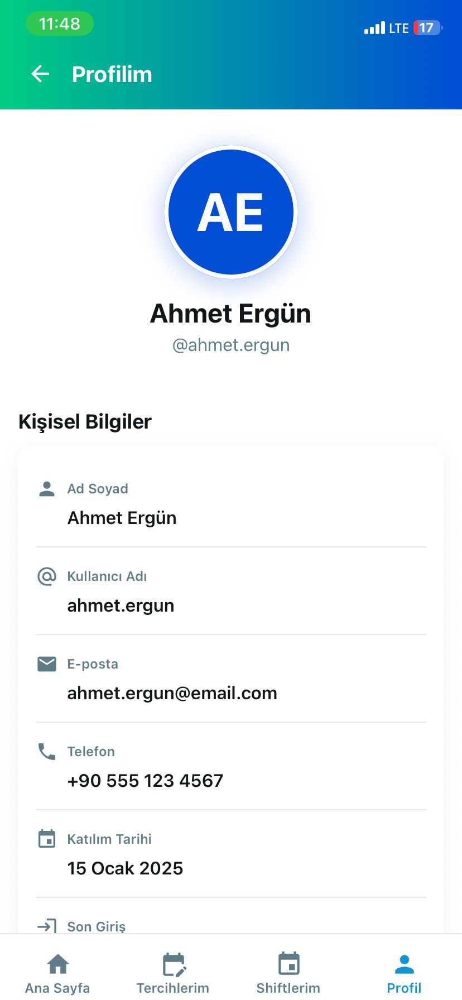

# 🚀 Shiffy - AI-Powered Shift Management System

**Smart shift scheduling for part-time employees powered by Meta's Llama AI**

<p align="center">
  
  
  
  
</p>

---

## 📋 İçindekiler

- [Proje Hakkında](#-proje-hakkında)
- [Problem](#-problem)
- [Çözümümüz](#-çözümümüz)
- [Özellikler](#-özellikler)
- [Teknoloji Stack](#-teknoloji-stack)
- [Proje Yapısı](#-proje-yapısı)
- [Kurulum](#-kurulum)
- [Dökümantasyon](#-dökümantasyon)
- [Deployment](#-deployment)
- [Mimari](#-mimari)
- [Ekip](#-ekip)
- [Lisans](#-lisans)

---

## 🎯 Proje Hakkında

**Shiffy**, yarı zamanlı çalışanları olan işletmeler için vardiya yönetimini devrimleştiren mobil-öncelikli bir **B2B2C platformudur**. **Meta & YTU Llama Hackathon 2025** kapsamında geliştirilen Shiffy, Meta'nın Llama AI modellerini kullanarak çalışan tercihlerine ve yönetici notlarına dayalı optimal vardiya takvimleri otomatik olarak oluşturur.

### 🏆 Hackathon Detayları
- **Etkinlik:** Meta & YTU Llama Hackathon 2025
- **Tarihler:** 24-26 Ekim 2025
- **Konum:** YTU Tarihi Hamam, İstanbul
- **Tema:** Verimlilik Araçları
- **Takım:** Golden Head
- **AI Model:** Meta Llama 3.2 70B Instruct (RunPod üzerinde barındırılan)

---

## 🔴 Problem

Yarı zamanlı işgücü yönetimi kritik zorluklarla karşı karşıya:

1. **Manuel Süreç:** Yöneticiler, vardiya takvimlerini manuel olarak oluşturmak için saatler harcıyor
2. **Tercih Toplama:** Çalışanlar tercihlerini WhatsApp/kağıt üzerinden gönderiyor, bu da iletişim hatalarına yol açıyor
3. **Adaletsiz Dağılım:** Uygun araçlar olmadan, vardiya dağılımı subjektif ve dengesiz hale geliyor
4. **Zaman Kaybı:** Tüm süreç hafta başına 2-3 gün alıyor
5. **Düşük Memnuniyet:** Hem yöneticiler hem de çalışanlar mevcut sistemden rahatsız

### 💼 Gerçek Dünya Etkisi
- Küçük işletmeler (kafeler, perakende mağazaları) **haftada 10+ saat** planlama ile harcıyor
- Adaletsiz vardiya dağılımı nedeniyle çalışan değişim oranı artıyor
- Yöneticiler, tercihleri iş gereksinimleriyle dengelemekte zorlanıyor
- İletişim kopukluğu ve yanlış anlamalar sık yaşanıyor

---

## ✅ Çözümümüz

**Shiffy**, tüm vardiya yönetim iş akışını otomatikleştirir:

### 📱 Yöneticiler İçin (B2B)
- ✨ Self-servis kayıt ve işletme kurulumu
- 👥 Kolay çalışan hesabı oluşturma ve yönetimi
- 📝 Çalışan tercihleri/güçlü yönleri hakkında bağlamsal notlar ekleme
- 🤖 Llama AI destekli saniyeler içinde vardiya takvimi oluşturma
- ✏️ Son ayarlamalar için manuel düzenleme yetenekleri
- ✅ Tek tıkla onay ve dağıtım
- 📊 Satış raporları takibi (günlük/haftalık)
- ⚙️ Esnek ayarlar (deadline, çalışma günleri, vardiya süreleri)

### 👤 Çalışanlar İçin (B2C)
- 🔐 Kullanıcı adı tabanlı güvenli giriş (e-posta gerekmiyor)
- 📅 30 dakikalık slot bazlı etkileşimli tercih seçimi
- 🎨 Renk kodlu müsaitlik sistemi (Müsait/Müsait Değil/İzin Talebi)
- 📊 Onaylanan takvimleri ve vardiya geçmişini görüntüleme
- ⏰ Deadline hatırlatıcıları
- 🔄 Otomatik taslak kaydetme (çevrimdışı destek)
- 🔒 İlk girişte güvenli şifre değiştirme

### 🧠 AI Destekli Zeka
- **Meta Llama 3.2 70B** modeli karmaşık planlama için
- ⚖️ Şunları dikkate alan adil dağıtım algoritması:
  - Çalışan müsaitlik tercihleri
  - Yönetici notları ve içgörüleri
  - Tüm çalışanlar arasında çalışma saati dengesi
  - Dinlenme süresi gereksinimleri (vardiyalar arası min. 8 saat)
  - Hafta sonu vardiya rotasyonu
  - Çalışma günü limitlerini dikkate alma

---

## 🚀 Özellikler

### ✅ Production-Ready Özellikler

#### 🎯 Yönetici Dashboard (Manager Panel)
- [x] **Çalışan Yönetimi:** CRUD operasyonları, çalışan notları, profil detayları
- [x] **Vardiya Tercih İncelemesi:** Tüm çalışanların tercihlerini grid görünümünde inceleme
- [x] **AI Takvim Oluşturma:** Llama 3.2 70B ile otomatik optimal takvim
- [x] **Manuel Düzenleme:** Drag-drop ile vardiya düzenleme, çalışan atama/çıkarma
- [x] **Takvim Onaylama:** Tek tıkla onaylama ve tüm çalışanlara dağıtım
- [x] **Satış Raporları:** Günlük/haftalık ciro ve satış sayısı takibi
- [x] **Ayarlar Yönetimi:** Deadline, çalışma günleri, vardiya süreleri ayarları
- [x] **İstatistikler:** Toplam çalışan, aktif çalışan, bekleyen tercihler

#### 👤 Çalışan Arayüzü (Employee Interface)
- [x] **Güvenli Giriş:** İlk girişte zorunlu şifre değiştirme
- [x] **Etkileşimli Vardiya Grid:** 30 dakikalık slotlar, haftalık görünüm
- [x] **Renk Kodlu Seçim:** Müsait (Yeşil) / Müsait Değil (Kırmızı) / İzin Talebi (Mavi)
- [x] **Otomatik Taslak:** Çevrimdışı çalışma desteği, otomatik kaydetme
- [x] **Takvim Görüntüleme:** Onaylanan vardiyaları görüntüleme
- [x] **Vardiya Geçmişi:** Geçmiş vardiyaları takip etme
- [x] **Profil Yönetimi:** Şifre değiştirme, hesap bilgileri

#### 🔧 Backend & AI
- [x] **Dual Authentication:** Yöneticiler için Supabase Auth, Çalışanlar için Custom JWT
- [x] **RunPod Llama Entegrasyonu:** Self-hosted GPU instance üzerinde Llama 3.2 70B
- [x] **Otomatik Cron Job:** Deadline gününde otomatik takvim oluşturma
- [x] **RESTful API:** 30+ endpoint (auth, employees, shifts, schedules, reports)
- [x] **Row-Level Security (RLS):** Supabase üzerinde veri izolasyonu
- [x] **Token Yönetimi:** Cache-busting, token refresh, AsyncStorage cleanup
- [x] **Error Handling:** Global error middleware, validation, logging

#### 🌐 Website (Landing Page)
- [x] **Modern Tasarım:** React + Vite + TypeScript + Tailwind CSS + shadcn/ui
- [x] **AI Chatbot:** Shiffy hakkında bilgi veren akıllı asistan
- [x] **Çoklu Dil:** Türkçe/İngilizce dil desteği
- [x] **Responsive:** Mobil, tablet, desktop uyumlu
- [x] **Özellik Showcase:** Manager ve Employee panellerinin screenshot'ları

### 🔮 Gelecek Geliştirmeler (Post-MVP)
- [ ] **Push Notifications:** Vardiya onaylandı, deadline hatırlatıcısı
- [ ] **Chat Tabanlı İstekler:** Çalışanlar arasında anlık mesajlaşma
- [ ] **Vardiya Değişimi:** Çalışanlar arası shift swap
- [ ] **Analitik Dashboard:** Çalışma saatleri, pattern analizi
- [ ] **Çoklu Mağaza Desteği:** Tek yöneticiden birden fazla işletme yönetimi
- [ ] **Yönetici-Çalışan Mesajlaşma:** Direkt iletişim kanalı
- [ ] **Export İşlemleri:** PDF, iCal formatında takvim dışa aktarma
- [ ] **Dark Mode:** Karanlık tema desteği
- [ ] **Design System:** Tutarlı UI component library
- [ ] **Performance Optimization:** Code splitting, lazy loading

---

## 🛠 Teknoloji Stack

### 📱 Frontend (Mobile App)
```yaml
Framework:          Expo SDK 54 (React Native 0.81.5)
Language:           TypeScript (strict mode)
Routing:            Expo Router (file-based routing)
Authentication:     Supabase Auth (Managers) + Custom JWT (Employees)
State Management:   React Hooks (useState, useEffect, useContext)
Storage:            AsyncStorage (@react-native-async-storage)
Styling:            NativeWind 4.2 (Tailwind CSS for React Native)
UI Components:      Custom components + expo-linear-gradient
Navigation:         @react-navigation/native + bottom-tabs
Icons:              @expo/vector-icons
Testing:            Jest + React Native Testing Library (TBD)
```

**Temel Kütüphaneler:**
- `@supabase/supabase-js` - Supabase client
- `expo-router` - File-based navigation
- `react-native-gesture-handler` - Gesture support
- `@react-native-picker/picker` - Native picker
- `expo-linear-gradient` - Gradient backgrounds

---

### ⚙️ Backend (API Server)
```yaml
Runtime:            Node.js 20.x
Framework:          Express.js 4.18
Language:           TypeScript 5.3
Database:           PostgreSQL (via Supabase)
Auth Provider:      Supabase Auth + Custom JWT
Password Hashing:   bcrypt 5.1.1
Token Generation:   jsonwebtoken 9.0.2
Scheduling:         node-cron 4.2.1 (automated tasks)
CORS:               cors 2.8.5
Testing:            Jest + Supertest (TBD)
Process Manager:    PM2 (production)
```

**Mimari Katmanlar:**
- **Routes:** HTTP endpoint handlers (auth, manager, employee, shift, schedule)
- **Services:** Business logic (auth, shift, auto-schedule, llama)
- **Repositories:** Database queries (direct Supabase client)
- **Middleware:** Authentication (JWT + Supabase), error handling
- **Utils:** JWT utilities, password hashing, validators

**API Endpoint'leri (30+):**
```
Authentication:
  POST   /api/employee/login
  POST   /api/employee/change-password

Manager:
  GET    /api/manager/employees
  POST   /api/manager/employees
  GET    /api/manager/employees/:id
  PATCH  /api/manager/employees/:id/notes
  PATCH  /api/manager/employees/:id/toggle-status

Shifts:
  POST   /api/shifts/preferences
  GET    /api/shifts/my-preferences
  GET    /api/shifts/requests

Schedules:
  POST   /api/schedules/generate
  POST   /api/schedules/:id/approve
  PATCH  /api/schedules/:id/shifts
  GET    /api/schedules
  GET    /api/schedules/my-schedule

Auto-Schedule:
  POST   /api/auto-schedule/trigger-all
  POST   /api/auto-schedule/trigger-me
  GET    /api/auto-schedule/status

Sales Reports:
  POST   /api/sales-reports
  GET    /api/sales-reports/daily/:date
  GET    /api/sales-reports/weekly/:weekStart
  DELETE /api/sales-reports/:id

Settings:
  GET    /api/manager/settings
  PATCH  /api/manager/settings
```

---

### 🧠 AI & Infrastructure
```yaml
AI Model:           Meta Llama 3.2 70B Instruct
AI Platform:        RunPod (self-hosted GPU instance)
API Protocol:       HTTP/REST
Prompt Engineering: Structured JSON prompts with context
Deployment:         Oracle Cloud Free Tier (4 vCPU, 24GB RAM)
Process Manager:    PM2 (cluster mode, auto-restart)
Reverse Proxy:      Nginx
SSL/TLS:            Let's Encrypt (Certbot)
CI/CD:              GitHub Actions (planned)
Monitoring:         PM2 logs, Supabase logs
```

**RunPod Kurulum:**
- GPU: NVIDIA A40 (48GB VRAM)
- Container: Ollama + Llama 3.2 70B
- Uptime: 24/7 with watchdog script
- Health Check: `/health` endpoint

---

### 🗄️ Database Schema (PostgreSQL via Supabase)
```sql
-- Tablolar
managers              # Yönetici hesapları (Supabase Auth ile entegre)
employees             # Çalışan hesapları (username + hashed password)
shift_preferences     # Çalışan vardiya tercihleri (30dk slot bazlı)
schedules             # AI tarafından oluşturulan takvimler
sales_reports         # Günlük/haftalık satış verileri
manager_settings      # İşletme ayarları (deadline, çalışma günleri)

-- Özellikler
- UUID primary keys
- JSONB columns (shifts, preferences)
- Row-Level Security (RLS) policies
- Indexes on foreign keys
- created_at / updated_at timestamps
- Soft delete with is_active flag
```

**RLS Politikaları:**
- Managers can only access their own employees
- Employees can only view/edit their own data
- Schedules are readable by all employees but editable only by manager

---

### 🌐 Website (Landing Page)
```yaml
Framework:          React 19 + Vite
Language:           TypeScript
UI Library:         shadcn/ui (Radix UI primitives)
Styling:            Tailwind CSS 3.4
State:              @tanstack/react-query
Routing:            React Router (implicit via Vite)
Icons:              lucide-react
Chatbot:            Custom AI assistant (future: RunPod Llama)
Deployment:         Lovable.dev (auto-deploy from git)
```

**Özellikler:**
- Responsive design (mobile-first)
- Multi-language support (TR/EN)
- AI chatbot assistant
- Screenshot carousel
- Feature showcase
- Contact form

---

## 📁 Proje Yapısı

```
shiffy/
├── README.md                           # Ana README (bu dosya)
├── LICENSE                             # MIT License
├── .gitignore
│
├── docs/                               # Proje-geneli dökümantasyon
│   ├── HACKATHON_FRONTEND_BACKEND_INTEGRATION.md
│   ├── MIGRATION_ROADMAP.md
│   └── AUTO_SCHEDULE_README.md
│
├── backend/                            # Node.js + Express API
│   ├── src/
│   │   ├── server.ts                  # Express server entry point
│   │   ├── config/                    # Konfigürasyon dosyaları
│   │   │   ├── env.config.ts         # Environment variables
│   │   │   ├── supabase.config.ts    # Supabase client
│   │   │   └── cors.config.ts        # CORS ayarları
│   │   │
│   │   ├── routes/                    # API route handlers
│   │   │   ├── index.ts              # Main router
│   │   │   ├── employee.routes.ts    # /api/employee/*
│   │   │   ├── manager.routes.ts     # /api/manager/*
│   │   │   ├── shift.routes.ts       # /api/shifts/*
│   │   │   ├── schedule.routes.ts    # /api/schedules/*
│   │   │   ├── sales-reports.routes.ts  # /api/sales-reports/*
│   │   │   ├── manager-settings.routes.ts
│   │   │   └── auto-schedule.routes.ts
│   │   │
│   │   ├── services/                  # Business logic
│   │   │   ├── auto-schedule.service.ts
│   │   │   ├── llama.service.ts      # RunPod Llama integration
│   │   │   └── schedule-validation.service.ts
│   │   │
│   │   ├── middleware/                # Express middleware
│   │   │   ├── auth.middleware.ts    # JWT + Supabase auth
│   │   │   └── error.middleware.ts   # Global error handler
│   │   │
│   │   ├── utils/                     # Utility functions
│   │   │   ├── jwt.utils.ts          # JWT generation/verification
│   │   │   └── password.utils.ts     # bcrypt helpers
│   │   │
│   │   └── types/                     # TypeScript type definitions
│   │       └── express.d.ts
│   │
│   ├── runpod-scripts/                # RunPod deployment scripts
│   │   ├── start_services.sh
│   │   ├── watchdog.sh
│   │   └── DEPLOY.md
│   │
│   ├── scripts/                       # Development scripts
│   │   ├── test-*.ts                 # Test scripts
│   │   └── setup-test-data-for-ai.ts
│   │
│   ├── docs/                          # Backend documentation
│   │   ├── SHIFFY_BACKEND_DOCS.md    # Kapsamlı API docs
│   │   ├── ROADMAP.md                # Development roadmap
│   │   ├── CHANGELOG.md              # Version history
│   │   ├── CLAUDE.md                 # AI development guide
│   │   └── RUNPOD_*.md               # RunPod setup guides
│   │
│   ├── package.json
│   ├── tsconfig.json
│   └── .env.example
│

│   │   └── index.ts                 # TypeScript type definitions
│   │
│   ├── utils/
│   │   └── storage.ts               # AsyncStorage helpers
│   │
│   ├── docs/                          # Frontend documentation
│   │   ├── SHIFFY_FRONTEND_DOCS.md
│   │   ├── ROADMAP.md
│   │   ├── UI_UX_ANALYSIS_AND_ROADMAP.md  # UI/UX iyileştirme planı
│   │   ├── FRONTEND_CLEANUP_ROADMAP.md    # Code cleanup roadmap
│   │   ├── QUICK_WINS_PROGRESS.md         # Completed quick wins
│   │   └── README.md                # Frontend README
│   │
│   ├── package.json
│   ├── tsconfig.json
│   ├── tailwind.config.js
│   ├── metro.config.js
│   └── app.json
│
└── website/                            # React + Vite Landing Page
    ├── src/
    │   ├── components/               # UI components
    │   │   └── ui/                  # shadcn/ui components
    │   ├── services/
    │   │   └── chatbot/             # AI chatbot service
    │   ├── contexts/
    │   │   └── LanguageContext.tsx  # Multi-language support
    │   ├── assets/
    │   │   └── screenshots.ts       # App screenshots
    │   ├── hooks/
    │   └── types/
    │
    ├── public/                        # Static assets
    ├── docs/
    │   ├── CHATBOT_README.md
    │   └── SCREENSHOT_GUIDE.md
    │
    ├── package.json
    ├── vite.config.ts
    ├── tailwind.config.ts
    └── components.json              # shadcn/ui config
```

### 📊 Proje İstatistikleri
- **Toplam Dosya Sayısı:** 200+ TypeScript/TSX dosyaları
- **Backend API Endpoints:** 30+
- **Frontend Screens:** 15+ (Manager: 7, Employee: 5, Auth: 4)
- **Component Library:** 20+ reusable components
- **Lines of Code:** ~20,000+ (backend + fr├── frontend/                           # React Native Mobile App
│   ├── app/                           # Expo Router screens
│   │   ├── _layout.tsx               # Root layout
│   │   ├── index.tsx                 # Splash screen
│   │   │
│   │   ├── (auth)/                   # Public auth screens
│   │   │   ├── _layout.tsx
│   │   │   ├── user-select.tsx      # Manager/Employee seçimi
│   │   │   ├── manager-login.tsx
│   │   │   ├── manager-register.tsx
│   │   │   ├── employee-login.tsx
│   │   │   └── employee-password-reset.tsx
│   │   │
│   │   ├── (manager)/                # Protected manager routes
│   │   │   ├── _layout.tsx
│   │   │   ├── dashboard.tsx        # Ana dashboard
│   │   │   ├── employees/           # Çalışan yönetimi
│   │   │   │   ├── index.tsx        # Liste
│   │   │   │   ├── add.tsx          # Yeni ekle
│   │   │   │   └── [id].tsx         # Detay/düzenle
│   │   │   ├── shift-review.tsx     # Tercih inceleme (1876 satır!)
│   │   │   ├── reports.tsx          # Satış raporları
│   │   │   └── settings.tsx         # Ayarlar
│   │   │
│   │   └── (employee)/               # Protected employee routes
│   │       ├── _layout.tsx
│   │       ├── home.tsx             # Ana ekran
│   │       ├── preferences.tsx      # Vardiya tercihleri
│   │       ├── my-shifts.tsx        # Takvim görüntüleme
│   │       └── profile.tsx          # Profil/şifre değiştirme
│   │
│   ├── components/                    # Reusable components
│   │   ├── ui/                       # Basic UI components
│   │   │   ├── Loading.tsx
│   │   │   ├── Button.tsx
│   │   │   └── Card/                # Card component
│   │   │
│   │   └── features/                 # Feature components
│   │       ├── StatCard.tsx         # Dashboard stats
│   │       ├── EmployeeCard.tsx
│   │       └── ShiftGrid/           # Shift selection grid
│   │
│   ├── services/                      # API clients
│   │   ├── api-client.ts            # Base HTTP client
│   │   ├── auth.ts                  # Manager auth (Supabase)
│   │   ├── employee-auth.ts         # Employee auth (JWT)
│   │   ├── employee.ts              # Employee CRUD
│   │   ├── shift.ts                 # Shift preferences
│   │   └── schedule.ts              # Schedule operations
│   │
│   ├── config/
│   │   └── supabase.config.ts       # Supabase client config
│   │
│   ├── constants/
│   │   └── theme.ts                 # Theme constants (needs design tokens!)
│   │
│   ├── hooks/                         # Custom React hooks
│   │   ├── use-color-scheme.ts
│   │   └── use-theme-color.ts
│   │
│   ├── types/ontend + website)

---

## 📸 Demo Screenshots

### 👔 Manager Panel

| Screenshot | Description |
|------------|-------------|
|  | **Dashboard** - İstatistikler, aktif çalışanlar, bekleyen tercihler genel bakış |
|  | **Çalışan Yönetimi** - Çalışan listesi, ekleme, düzenleme, notlar |
|  | **Vardiya İnceleme** - Tüm çalışanların tercihlerini grid görünümünde inceleme |
|  | **AI Takvim Oluşturma** - Llama 3.2 70B ile otomatik vardiya planı |
|  | **Manuel Düzenleme** - AI'nin oluşturduğu takvimleri düzenleme |
|  | **Satış Raporları** - Günlük/haftalık ciro ve satış takibi |
|  | **Ayarlar** - Deadline, çalışma günleri, vardiya süreleri |

### 👤 Employee Interface

| Screenshot | Description |
|------------|-------------|
|  | **Ana Ekran** - Hoşgeldin mesajı, next shift, quick actions |
|  | **Tercih Girişi** - 30dk slot bazlı interaktif vardiya tercihleri grid |
|  | **Takvim Görüntüleme** - Onaylanan vardiya takvimini görüntüleme |
|  | **Vardiyalarım** - Haftalık vardiya programı detaylı görünüm |
|  | **Profil** - Hesap bilgileri, şifre değiştirme, ayarlar |

**Note:** Tüm screenshot'lar gerçek mobil uygulamadan alınmıştır. Daha detaylı UI/UX analizi için [Frontend UI/UX Documentation](./frontend/docs/UI_UX_ANALYSIS_AND_ROADMAP.md) dosyasına bakabilirsiniz.

---

## � Kurulum

---

## 📚 Dökümantasyon

### 🎯 Ana Dökümantasyon
- **[Backend Teknik Dökümanlar](./backend/SHIFFY_BACKEND_DOCS.md)** - API server, database, Llama entegrasyonu, deployment
- **[Frontend Teknik Dökümanlar](./frontend/SHIFFY_FRONTEND_DOCS.md)** - Mobile app mimarisi, ekranlar, component'ler
- **[Frontend Roadmap](./frontend/docs/ROADMAP.md)** - Development roadmap ve feature planning
- **[UI/UX Analysis](./frontend/docs/UI_UX_ANALYSIS_AND_ROADMAP.md)** - Tasarım sistemi ve iyileştirme planı

### 🔧 Backend Dökümanları
- **[Backend Changelog](./backend/CHANGELOG.md)** - Detaylı development log
- **[Backend Roadmap](./backend/ROADMAP.md)** - Phase-by-phase development plan
- **[RunPod Setup](./backend/RUNPOD_OLLAMA_SETUP.md)** - Llama 3.2 70B deployment guide
- **[RunPod Production](./backend/RUNPOD_PRODUCTION.md)** - Production deployment
- **[Claude Development Guide](./backend/CLAUDE.md)** - AI-assisted development patterns

### 📱 Frontend Dökümanları
- **[Frontend Cleanup Roadmap](./frontend/docs/FRONTEND_CLEANUP_ROADMAP.md)** - Code quality improvements
- **[Quick Wins Progress](./frontend/docs/QUICK_WINS_PROGRESS.md)** - Completed improvements
- **[Clear Token Instructions](./frontend/docs/CLEAR_TOKEN_INSTRUCTIONS.md)** - Authentication debugging
- **[Debug Token Analysis](./frontend/docs/DEBUG_TOKEN_ANALYSIS.md)** - Token management deep dive

### 🌐 Website Dökümanları
- **[Chatbot README](./website/CHATBOT_README.md)** - AI chatbot implementation
- **[Chatbot API Guide](./website/CHATBOT_API_GUIDE.md)** - API integration guide
- **[Screenshot Guide](./website/SCREENSHOT_GUIDE.md)** - App screenshot specifications

### 🔄 Integration & Migration
- **[Frontend-Backend Integration](./HACKATHON_FRONTEND_BACKEND_INTEGRATION.md)** - Integration roadmap
- **[Migration Roadmap](./MIGRATION_ROADMAP.md)** - Migration planning
- **[Auto Schedule README](./AUTO_SCHEDULE_README.md)** - Automated scheduling system

---

## 🚢 Deployment

### 📱 Mobile App (Frontend)

#### Expo EAS Build (Recommended)
```bash
cd frontend

# Install EAS CLI
npm install -g eas-cli

# Login to Expo
eas login

# Configure build
eas build:configure

# Build for Android
eas build --platform android --profile production

# Build for iOS
eas build --platform ios --profile production

# Submit to stores
eas submit --platform android
eas submit --platform ios
```

#### Manual Build
```bash
# Android APK
npx expo build:android -t apk

# iOS IPA (requires Apple Developer account)
npx expo build:ios -t archive
```

**Environment Variables (Production):**
- Update `EXPO_PUBLIC_API_URL` to production backend URL
- Update Supabase keys to production credentials

---

### ⚙️ Backend (API Server)

#### Oracle Cloud Free Tier Deployment

**Spec:**
- VM.Standard.E2.1.Micro (4 vCPU, 24GB RAM)
- Ubuntu 22.04 LTS
- Always Free eligible

**Adım Adım:**
```bash
# 1. SSH ile bağlan
ssh ubuntu@your-instance-ip

# 2. Node.js 20 kur
curl -fsSL https://deb.nodesource.com/setup_20.x | sudo -E bash -
sudo apt-get install -y nodejs

# 3. PM2 kur (process manager)
sudo npm install -g pm2

# 4. Repository klonla
git clone https://github.com/ymcbzrgn/Shiffy.git
cd Shiffy/backend

# 5. Dependencies yükle
npm install

# 6. .env dosyası oluştur
nano .env
# Production credentials'ları gir

# 7. TypeScript compile
npm run build

# 8. PM2 ile başlat
pm2 start dist/server.js --name shiffy-backend -i max

# 9. Startup script oluştur (reboot sonrası otomatik başlat)
pm2 startup
pm2 save

# 10. Nginx reverse proxy (opsiyonel ama önerilir)
sudo apt install nginx
sudo nano /etc/nginx/sites-available/shiffy
```

**Nginx Config (`/etc/nginx/sites-available/shiffy`):**
```nginx
server {
    listen 80;
    server_name api.shiffy.com;

    location / {
        proxy_pass http://localhost:3000;
        proxy_http_version 1.1;
        proxy_set_header Upgrade $http_upgrade;
        proxy_set_header Connection 'upgrade';
        proxy_set_header Host $host;
        proxy_cache_bypass $http_upgrade;
    }
}
```

```bash
# Nginx enable ve restart
sudo ln -s /etc/nginx/sites-available/shiffy /etc/nginx/sites-enabled/
sudo nginx -t
sudo systemctl restart nginx

# SSL kurulum (Let's Encrypt)
sudo apt install certbot python3-certbot-nginx
sudo certbot --nginx -d api.shiffy.com
```

**PM2 Monitoring:**
```bash
pm2 status           # Process durumu
pm2 logs shiffy-backend  # Logs
pm2 monit            # Real-time monitoring
pm2 restart shiffy-backend  # Restart
```

---

### 🧠 RunPod Llama Deployment

**Detaylı Guide:** `backend/RUNPOD_OLLAMA_SETUP.md`

**Özet:**
1. RunPod hesabı oluştur
2. NVIDIA A40 (48GB) GPU instance başlat
3. Ollama container deploy et
4. Llama 3.2 70B modelini yükle
5. Health check ve watchdog script'leri kur
6. API endpoint'i backend `.env`'ye ekle

**Test:**
```bash
# Health check
curl https://your-runpod.runpod.io/health

# Llama test
curl -X POST https://your-runpod.runpod.io/api/generate \
  -H "Content-Type: application/json" \
  -d '{
    "model": "llama3.2:70b",
    "prompt": "Test prompt",
    "stream": false
  }'
```

---

### 🌐 Website Deployment

**Lovable.dev (Current):**
- Auto-deploy from GitHub push
- Custom domain support
- HTTPS by default

**Alternative: Vercel/Netlify:**
```bash
cd website

# Build
npm run build

# Output: dist/

# Deploy to Vercel
npm install -g vercel
vercel --prod

# Deploy to Netlify
npm install -g netlify-cli
netlify deploy --prod --dir=dist
```

---

## 🏗️ Mimari

### Sistem Mimarisi

```
┌─────────────────────────────────────────────────────────────┐
│                    Mobile App (Expo)                         │
│  ┌─────────────────┐           ┌──────────────────┐         │
│  │  Manager Panel  │           │  Employee Panel  │         │
│  │  - Dashboard    │           │  - Preferences   │         │
│  │  - Shift Review │           │  - My Shifts     │         │
│  │  - Reports      │           │  - Profile       │         │
│  └─────────────────┘           └──────────────────┘         │
└───────────────┬─────────────────────────┬───────────────────┘
                │                         │
                │    HTTPS/REST API       │
                ▼                         ▼
┌───────────────────────────────────────────────────────────────┐
│              Express Backend (Node.js 20)                      │
│  ┌──────────────────────────────────────────────────────────┐ │
│  │  Route Layer                                             │ │
│  │  /api/employee  /api/manager  /api/shifts  /api/schedules│ │
│  └────────────────────┬─────────────────────────────────────┘ │
│                       │                                        │
│  ┌────────────────────▼─────────────────────────────────────┐ │
│  │  Middleware Layer                                        │ │
│  │  - authMiddleware (JWT + Supabase)                       │ │
│  │  - errorHandler                                          │ │
│  │  - CORS                                                  │ │
│  └────────────────────┬─────────────────────────────────────┘ │
│                       │                                        │
│  ┌────────────────────▼─────────────────────────────────────┐ │
│  │  Service Layer                                           │ │
│  │  - autoScheduleService (Cron + AI)                       │ │
│  │  - llamaService (RunPod API)                             │ │
│  │  - scheduleValidationService                             │ │
│  └────────────────────┬─────────────────────────────────────┘ │
│                       │                                        │
│  ┌────────────────────▼─────────────────────────────────────┐ │
│  │  Database Layer (Direct Supabase Client)                 │ │
│  │  - No ORM (KISS principle)                               │ │
│  │  - Row-Level Security (RLS)                              │ │
│  └──────────────────────────────────────────────────────────┘ │
└─────────────┬─────────────────────────┬───────────────────────┘
              │                         │
              ▼                         ▼
┌──────────────────────┐    ┌──────────────────────────┐
│   Supabase (PG)      │    │  RunPod (Llama 3.2 70B)  │
│   - managers         │    │  - GPU: NVIDIA A40       │
│   - employees        │    │  - Ollama container      │
│   - shift_preferences│    │  - Watchdog script       │
│   - schedules        │    │  - Health monitoring     │
│   - sales_reports    │    └──────────────────────────┘
│   - manager_settings │
└──────────────────────┘
              ▲
              │ Cron Trigger (node-cron)
  ┌───────────┴──────────┐
  │  Automated Scheduler │
  │  - Deadline-based    │
  │  - Weekly trigger    │
  └──────────────────────┘
```

### Authentication Flow

```
Manager Authentication (Supabase):
1. User enters email + password
2. Supabase Auth validates credentials
3. Returns session token
4. Token stored in Supabase client (NOT AsyncStorage)
5. Backend verifies via supabase.auth.getUser(token)

Employee Authentication (Custom JWT):
1. User enters username + password
2. Backend validates via bcrypt
3. Generates JWT with 7-day expiry
4. Token stored in AsyncStorage ('auth_token')
5. Backend verifies via jwt.verify()

Dual Auth Middleware:
1. Extract Bearer token from header
2. Try custom JWT verification (employees)
3. If fails, try Supabase auth (managers)
4. Attach user info to req.user
5. Proceed to route handler
```

### Data Flow (Shift Creation Example)

```
1. Manager creates employees via /api/manager/employees
   ↓
2. Employees login and submit shift preferences
   ↓ POST /api/shifts/preferences
3. Preferences stored in shift_preferences table (JSONB)
   ↓
4. Deadline day arrives → Cron job triggers
   ↓ autoScheduleService.runForAllManagers()
5. For each manager:
   a. Fetch all employees + preferences
   b. Fetch manager notes and settings
   c. Build Llama prompt with context
   d. Send to RunPod Llama API
   e. Parse AI response (shift assignments)
   f. Validate + save to schedules table
   ↓
6. Manager reviews schedule via /api/schedules
   ↓ Manual edits if needed
7. Manager approves via /api/schedules/:id/approve
   ↓
8. Employees view via /api/schedules/my-schedule
```

---

## 👥 Ekip

**Team Golden Head**

### Team Members
- **Yamaç Bezirgan** - Project Lead & Full Stack Development
- **Bekir Çakır** - Backend Development & AI Integration
- **Bartın Taha Bakıcı** - Frontend Development & Mobile
- **Ertuğrul Likos** - UI/UX Design & Quality Assurance

### Technologies
- **AI Model:** Meta Llama 3.2 70B on RunPod
- **Backend:** Node.js + Express + TypeScript
- **Frontend:** React Native + Expo + NativeWind
- **Database:** PostgreSQL (Supabase)

---

## 📄 Lisans

Bu proje **MIT License** ile lisanslanmıştır. Detaylar için [LICENSE](./LICENSE) dosyasına bakın.

---

## 🙏 Teşekkürler

- **Meta** - Llama 3.2 70B modelini açık kaynak olarak sağladığı için
- **YTU** - Hackathon'u düzenlediği için
- **RunPod** - GPU infrastructure için
- **Supabase** - Backend-as-a-Service için
- **Expo** - React Native development platform için

---

## 📞 İletişim

- **GitHub:** [github.com/ymcbzrgn/Shiffy](https://github.com/ymcbzrgn/Shiffy)
- **Website:** [shiffy.com](https://shiffy.com) (coming soon)
- **Email:** support@shiffy.com

---

<p align="center">
  Made with ❤️ during Meta & YTU Llama Hackathon 2025
</p>
<p align="center">
  🚀 Powered by Meta Llama 3.2 70B
</p>
- **[Database Schema](./docs/DATABASE_SCHEMA.md)** - Supabase table definitions and RLS policies

### Setup Guides
- **[Frontend Setup Guide](./frontend/docs/SETUP.md)** - Detailed Expo setup instructions
- **[Backend Setup Guide](./backend/docs/SETUP.md)** - Node.js server configuration
- **[RunPod Llama Guide](./backend/docs/LLAMA_INTEGRATION.md)** - AI model deployment

### Deployment Guides
- **[Oracle Cloud Deployment](./backend/docs/DEPLOYMENT.md)** - PM2 + Nginx setup
- **[CI/CD Pipeline](./docs/DEPLOYMENT.md#cicd)** - GitHub Actions automation

---

## 🚀 Deployment

### Production Deployment Architecture

```
┌─────────────────┐
│   Mobile App    │
│   (Expo EAS)    │
└────────┬────────┘
         │ HTTPS
         ▼
┌─────────────────────────────────────┐
│       Nginx (Reverse Proxy)         │
│       Oracle Cloud Free Tier        │
│       Ubuntu 22.04 LTS              │
└────────┬────────────────────────────┘
         │
         ▼
┌─────────────────────────────────────┐
│       PM2 (Process Manager)         │
│       Node.js Backend               │
│       Port 3000                     │
└────────┬────────────────┬───────────┘
         │                │
         ▼                ▼
┌────────────────┐  ┌──────────────────┐
│   Supabase     │  │   RunPod Llama   │
│   PostgreSQL   │  │   3.2 70B GPU    │
└────────────────┘  └──────────────────┘
```

### Deployment Steps

#### 1. Backend (Oracle Cloud)
```bash
# SSH into Oracle Cloud instance
ssh ubuntu@<oracle-public-ip>

# Clone repository
git clone https://github.com/your-org/shiffy.git
cd shiffy/backend

# Install dependencies
npm install

# Build TypeScript
npm run build

# Start with PM2
pm2 start dist/server.js --name shiffy-backend
pm2 save
pm2 startup
```

**See:** [Backend Deployment Guide](./backend/docs/DEPLOYMENT.md)

#### 2. Frontend (Expo EAS)
```bash
cd frontend

# Install EAS CLI
npm install -g eas-cli

# Login to Expo
eas login

# Configure build
eas build:configure

# Build for iOS
eas build --platform ios

# Build for Android
eas build --platform android
```

**See:** [Frontend Deployment Guide](./frontend/docs/DEPLOYMENT.md)

#### 3. RunPod Llama Instance
1. Go to https://www.runpod.io
2. Deploy **Text Generation Inference** template
3. Select **A40 GPU** (48GB VRAM)
4. Set model: `meta-llama/Llama-3.2-70B-Instruct`
5. Copy HTTP Service URL
6. Add URL to backend `.env`

**See:** [Llama Integration Guide](./backend/docs/LLAMA_INTEGRATION.md)

---

## 🔐 Security Considerations

### Authentication
- **Managers:** Supabase Auth (email + password, JWT tokens)
- **Employees:** Custom backend auth (username + password, bcrypt hashing)
- **Token Expiry:** Manager: 1hr access + 30d refresh, Employee: 7d access
- **First Login:** Employees forced to change temporary password

### API Security
- **CORS:** Whitelist only authorized domains
- **Rate Limiting:** 100 requests per 15 minutes per IP
- **JWT Verification:** All protected routes validated via middleware
- **SQL Injection:** Prevented via Supabase parameterized queries
- **XSS Prevention:** Input validation and sanitization

### Database Security
- **Row-Level Security (RLS):** Managers can only access their own data
- **Service Role Key:** Never exposed to frontend
- **API Keys:** Stored in secure environment variables
- **Encrypted Storage:** Mobile app uses Expo SecureStore

### Infrastructure Security
- **HTTPS Only:** Let's Encrypt SSL certificates
- **Firewall:** Ubuntu UFW + Oracle Cloud security lists
- **SSH Keys:** Password authentication disabled
- **PM2 User:** Non-root user for Node.js process

---

## 👥 Team

**Team Name:** Golden Head

### Team Members
- **Yamaç Bezirgan** ([@ymcbzrgn](https://github.com/ymcbzrgn)) - Project Lead & Full Stack Developer
- **Bekir Çakır** - Backend Developer & AI Integration Specialist
- **Bartın Taha Bakıcı** - Frontend Developer & Mobile Engineer
- **Ertuğrul Likos** - UI/UX Designer & Quality Assurance

### Roles & Responsibilities
- **Backend Team:** Node.js API development, Llama AI integration, database schema design, RunPod deployment
- **Frontend Team:** Expo mobile app, React Native UI components, state management, API integration
- **AI Integration:** Prompt engineering, fine-tuning, RAG system implementation
- **UI/UX Design:** User interface design, user experience optimization, accessibility
- **Documentation:** Technical documentation, API specifications, README files, deployment guides

---

## 🏆 Hackathon Deliverables

### Technical Implementation
- ✅ Mobile app (iOS & Android)
- ✅ Backend API (20+ endpoints)
- ✅ AI integration (Llama 3.2 70B)
- ✅ Database (5 tables with RLS)
- ✅ Automated cron jobs
- ✅ Production deployment (Oracle Cloud)

### Documentation
- ✅ Complete technical documentation (frontend + backend)
- ✅ API reference with examples
- ✅ Database schema with relationships
- ✅ Deployment guides
- ✅ Setup instructions

### Presentation Materials
- ✅ Pitch deck (10 slides)
- ✅ Live demo video
- ✅ GitHub repository (public)
- ✅ Technical architecture diagram

---

## 📊 Demo Credentials

### Manager Account (Test)
```
Email:    demo.manager@shiffy.com
Password: ShiffyDemo2025!
Store:    Golden Head Cafe (Demo)
```

### Employee Accounts (Test)
```
Username: demo_employee1    Password: Employee123!
Username: demo_employee2    Password: Employee123!
Username: demo_employee3    Password: Employee123!
```

**⚠️ Important:**
- These are **test accounts** for demonstration purposes only
- For production use, create your own secure accounts
- Default employee passwords must be changed on first login
- Manager accounts use Supabase Auth with email verification

---

## 🐛 Known Issues & Limitations (MVP)

### Current Limitations
- Single store per manager (multi-store support planned)
- No push notifications (planned for v2)
- Manual conflict resolution required for edge cases
- English/Turkish language only
- Limited to 50 employees per store

### Planned Improvements
- Real-time updates via WebSocket
- Advanced analytics dashboard
- Employee shift swap requests
- Mobile app offline mode
- Export to Google Calendar/Outlook

---

## 📝 License

This project was developed for the **Meta & YTU Llama Hackathon 2025**.

**License:** MIT License

Copyright (c) 2025 Team Golden Head

Permission is hereby granted, free of charge, to any person obtaining a copy
of this software and associated documentation files (the "Software"), to deal
in the Software without restriction, including without limitation the rights
to use, copy, modify, merge, publish, distribute, sublicense, and/or sell
copies of the Software, and to permit persons to whom the Software is
furnished to do so, subject to the following conditions:

The above copyright notice and this permission notice shall be included in all
copies or substantial portions of the Software.

THE SOFTWARE IS PROVIDED "AS IS", WITHOUT WARRANTY OF ANY KIND, EXPRESS OR
IMPLIED, INCLUDING BUT NOT LIMITED TO THE WARRANTIES OF MERCHANTABILITY,
FITNESS FOR A PARTICULAR PURPOSE AND NONINFRINGEMENT. IN NO EVENT SHALL THE
AUTHORS OR COPYRIGHT HOLDERS BE LIABLE FOR ANY CLAIM, DAMAGES OR OTHER
LIABILITY, WHETHER IN AN ACTION OF CONTRACT, TORT OR OTHERWISE, ARISING FROM,
OUT OF OR IN CONNECTION WITH THE SOFTWARE OR THE USE OR OTHER DEALINGS IN THE
SOFTWARE.

---

## 🙏 Acknowledgments

- **Meta AI** - For providing Llama models and hosting the hackathon
- **Yıldız Technical University** - For venue and organization
- **Supabase** - For excellent PostgreSQL + Auth platform
- **RunPod** - For affordable GPU compute
- **Oracle Cloud** - For generous free tier
- **Expo Team** - For amazing React Native framework

---

## 📞 Contact & Support

### Project Links
- **GitHub Repository:** [github.com/ymcbzrgn/Shiffy](https://github.com/ymcbzrgn/Shiffy)
- **Team Lead:** Yamaç Bezirgan ([@ymcbzrgn](https://github.com/ymcbzrgn))
- **Hackathon:** Meta & YTU Llama Hackathon 2025 (October 24-26, 2025)

### Get in Touch
- **Project Email:** yamac.bezirgan@gmail.com
- **Team:** Team Golden Head
- **Event:** YTU Tarihi Hamam, İstanbul

### Support
For issues and questions:
1. Check [Documentation](#-dökümantasyon) for detailed guides
2. Search [GitHub Issues](https://github.com/ymcbzrgn/Shiffy/issues) for similar problems
3. Create new issue with detailed description and reproduction steps
4. Contact team lead for urgent matters

---

## 🎉 Thank You!

Thank you for checking out **Shiffy**! We hope this project demonstrates the power of AI-driven automation in solving real-world workforce management challenges.

**Built with ❤️ by Team Golden Head during Meta & YTU Llama Hackathon 2025**

---

<p align="center">
  
  
  
</p>

<p align="center">
  <sub>Hackathon Project • October 24-26, 2025 • Istanbul, Turkey</sub>
</p>